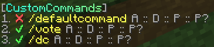

# CustomCommands <sub>for Velocity</sub>

This is a Velocity plugin that allows you to create custom commands.
It offers you a simple way to create commands that can be executed by players.
These commands can be customized to your liking.

## Installation

1. Download the latest release from the [modrinth](https://modrinth.com/plugin/customcommandsvelocity/versions).
2. Put the jar file in `plugins/`.
3. Restart your server.

## Usage

| Command                   | Description                                               | Permission               |
|---------------------------|-----------------------------------------------------------|--------------------------|
| `/customcommands reload`  | Reload the configuration file and all the custom commands | `customcommands.reload`  |
| `/customcommands list`    | List all custom commands                                  | `customcommands.list`    |
| `/customcommands help`    | Show the help page                                        | `customcommands.help`    |
| `/customcommands version` | Show the plugin's version                                 | `customcommands.version` |
| `/customcommands`         | Show the help page                                        | `customcommands.help`    |

All these commands require their respective permissions or the `customcommands.admin` permission.
They can also be executed via `/cc`.

### `/customcommands list`

This command displays a list of all custom commands, which looks like this:
<br>
<ul>
<li>The ✔/❌ indicates whether the command is enabled or disabled.</li>
<li>The yellow string is the command name. Click to suggest the command in the chat input.</li>
<li>Hover A to see an array of all the aliases.</li>
<li>Hover D to see the description.</li>
<li>Hover P to see the permission.</li>
<li>Hover P? to see whether the prefix should be added to the response message.</li>
</ul>

## Configuration

### `config.toml`

The config is located at `plugins/customcommands/config.toml`.
<details>
<summary>Content of config.toml</summary>

```toml
# CustomCommands Configuration

# This is the prefix that will be displayed in front of all messages
# Only supports MiniMessage, see https://docs.advntr.dev/minimessage/format.html and https://webui.advntr.dev/ for more information
Prefix = "<gray>[<gradient:#38ffdb:#8aff8c>CustomCommands<gray>]"

# This is the default message that will be displayed when a player does not have permission to execute a command
No-Permission = "<red>You do not have permission to execute this command."

# This is the default message that will be displayed when a command is run from the console, but the command is not allowed to be run from the console
No-Console-Command = "This command cannot be run from console!"

# This is the default message that will be displayed when a command has been executed successfully
Command-Executed = "<green>Command executed successfully."

# Do not change this
Config-Version = 1.0
```

</details>

### Custom Commands

Create your custom commands in `plugins/customcommands/Commands/`.
Each command is saved in a separate toml file.

<details>
<summary>Content of the default command file (DefaultCommand.toml)</summary>

```toml
# Command Configuration

# Enabled?
Enabled = true

# This is the command name that will be used to call the command in the chat
Name = "defaultcommand"

# These are the aliases. Empty the array if you don't want any aliases, like so: Aliases = []
Aliases = ["default", "defaultcmd"]

# This is the description of the command that will be displayed in the help command
Description = "This is the default command of CustomCommands"

# This is the permission required to use the command. Leave empty for no permission
Permission = "customcommands.defaultcommand"

# This is the response that will be sent when the command is called. Leave empty for no response
# Only supports MiniMessage, see https://docs.advntr.dev/minimessage/format.html and https://webui.advntr.dev/ for more information
Response = "<green>Command executed successfully!"

# Add the plugins Prefix configured in config.toml to the response message
UsePrefix = true

# This is the cooldown of the command in seconds
Cooldown = 0
```

</details>
